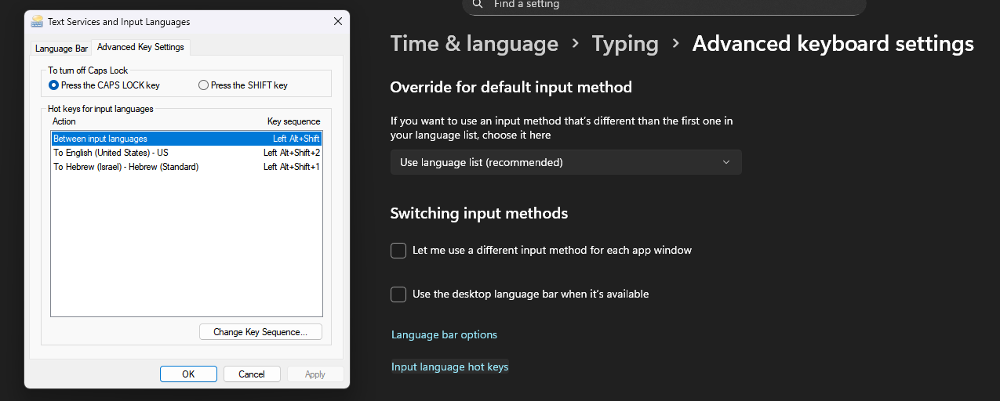
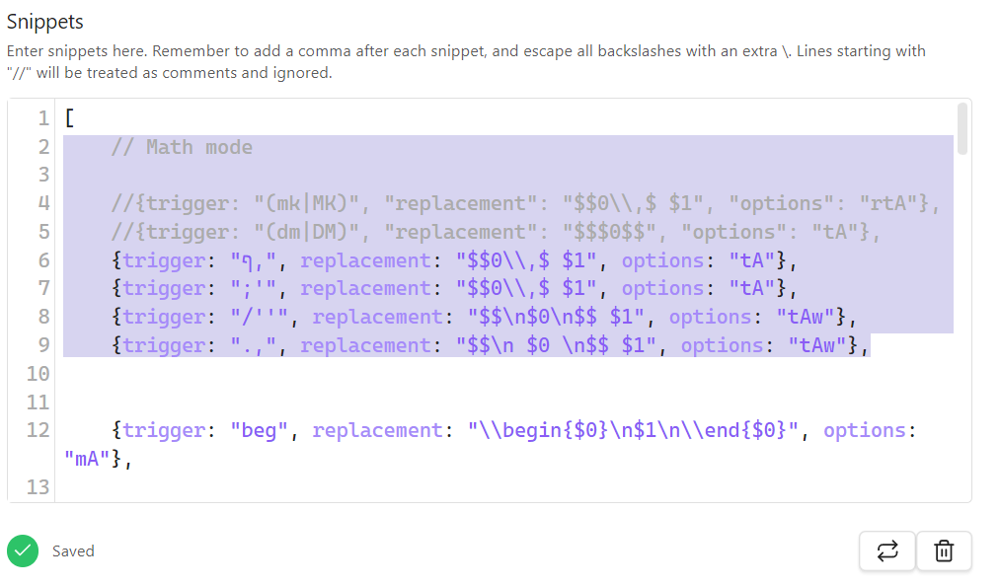

# Obsidian Latex Multilingual

An Obsidian plugin designed for bilingual users who frequently switch between a Right-to-Left (RTL) language (like Hebrew) and a Left-to-Right (LTR) language (like English), especially when writing mathematical notes with LaTeX.

This plugin automates the tedious process of switching keyboard layouts and text direction, allowing for a seamless and efficient note-taking experience.

# Important Note:
For the plugin to switch languages, currently the best solution i found is setting a custom keyboard shortcut for each language in windows keyboard layout settings and then executing this shortcut using the python server. to set up the keyboard shortcuts you need to go search for "Typing settings" in windows start menu, then go to "Advanced keyboard settings" and click on "Input language hot keys" and set your prefered keyboard shortcut for each language. 

Another important improvment you really should make is changing latex-suite plugin inline and block math execution snippet, i've changed how latex-suite starts inline math and block math so that it would work better with this plugin and prevent inline math flickering (just by adding a simple white space at the end of the expression). also i added the ability to start math mode both from hebrew and english. you start inline math by pressing ;' and block math by pressing /' 
you should copy this lines to your latex-suite snippets code in obsidian: 
    // Math mode

    //{trigger: "(mk|MK)", "replacement": "$$0\\,$ $1", "options": "rtA"},
    //{trigger: "(dm|DM)", "replacement": "$$$0$$", "options": "tA"},
	{trigger: "ף,", replacement: "$$0\\,$ $1", options: "tA"},
    {trigger: ";'", replacement: "$$0\\,$ $1", options: "tA"},
	{trigger: "/''", replacement: "$$\n$0\n$$ $1", options: "tAw"},
    {trigger: ".,", replacement: "$$\n $0 \n$$ $1", options: "tAw"},

this is how it should look:


## Features

- **Automatic Language Switching:** Intelligently detects when your cursor enters or exits a MathJax environment ('$$...$$' or `$...$`) and automatically switches your system's keyboard layout.
    
- **Self-Contained Server:** The plugin automatically starts and stops its own lightweight Python background server, so you never have to manage it manually.
    
- **Manual Direction Control:** Provides a command to manually force the current line's text direction to LTR. This is perfect for easily navigating and editing complex inline math expressions within an RTL paragraph.
    
- **Full Customization:** A comprehensive settings menu allows you to:
    
    - Enable or disable the plugin.
        
    - Specify the paths to your Python executable and the server script.
        
    - Define the exact keyboard shortcuts for switching to each language.
        
- **Live Status Indicators:** A status bar item shows the current language mode (EN/HE) and the server's connection status. The settings menu also provides a live "Online/Offline" check.
    

## How It Works

The plugin uses a robust client-server model to safely interact with your operating system:

1. **The Obsidian Plugin (Client):** Written in TypeScript, this part lives inside Obsidian. It uses the modern CodeMirror 6 editor's syntax tree to reliably detect when the cursor is inside a math environment.
    
2. **The Python Server (Backend):** A lightweight Flask server that runs silently in the background (managed by the plugin). When it receives a command from the plugin, it uses `pyautogui` to simulate the keyboard shortcuts you've configured, changing your system's language.
    

This architecture ensures that the plugin never leaves the secure sandbox of Obsidian, while still giving you powerful automation capabilities.

## Requirements

- Obsidian v1.5.0 or newer.
    
- Python 3.x installed on your system.
    
- The following Python libraries: `Flask`, `pyautogui`, `flask-cors`.
    

## Installation and Setup

### Step 1: Set Up the Python Server

1. Create a permanent folder on your computer for the server (e.g., `C:\obsidian-switcher-server`).
    
2. Inside that folder, create a new file named `lang_server.py` and copy the Python code from our guide into it.
    
3. Open a Command Prompt or PowerShell and install the required libraries by running:
    
    ```
    pip install Flask pyautogui flask-cors
    ```
    

### Step 2: Install the Plugin in Obsidian

1. Go to the [Releases page](https://www.google.com/search?q=https://github.com/YOUR_USERNAME/obsidian-latex-multilingual/releases "null") of this GitHub repository.
    
2. Download the latest `main.js`, `manifest.json`, and `styles.css` files.
    
3. In your Obsidian vault, go to `Settings` > `Community Plugins`.
    
4. Click the folder icon to open your vault's plugins folder (`.obsidian/plugins`).
    
5. Create a new folder inside `plugins` named `obsidian-latex-multilingual`.
    
6. Copy the three downloaded files (`main.js`, `manifest.json`, `styles.css`) into this new folder.
    
7. Go back to Obsidian's Community Plugins settings and click the "Reload plugins" button.
    
8. Find "Obsidian Latex Multilingual" in the list and enable it.
    

### Step 3: Configure the Plugin

1. Go to `Settings` > `Community Plugins` and click the gear icon next to "Obsidian Latex Multilingual".
    
2. **Crucially, you must fill in the "Server Script Path"** with the full, absolute path to the `lang_server.py` file you created in Step 1.
    
3. Verify that the "Python Executable Path" is correct (for most users, the default "python" is fine).
    
4. Customize your keyboard shortcuts for switching between English and Hebrew.
    
5. (Optional) Go to `Settings` > `Hotkeys` and assign a convenient hotkey (like `Ctrl+E`) to the "Toggle LTR for Active Line" command.
    

The plugin is now ready to use!

Google Gemini 2.5 Pro Canvas instructions:

Introduction
Congratulations on building your first Obsidian plugin! This guide will walk you through the final, polished version, which automatically creates and manages its own Python environment, launches its own background server, switches your keyboard language, and includes a settings menu to customize everything.

This version is a complete, self-contained solution that provides the best possible user experience.

We will build two components:

A Python Server: A flexible server that can press any keyboard shortcut it's told to. The plugin will manage creating the environment for, starting, and stopping this server automatically.

An Obsidian Plugin: This plugin will automatically switch your keyboard language when you enter a math environment and provide a command to manually set the text direction for easy editing.

Let's get started!

Part 1: The Python Language-Switching Server
This server is the bridge between Obsidian and your operating system.

Step 1.1: Create the Server Files
Inside your main plugin project folder (language-switcher-plugin), create a new sub-folder named server.

Inside this new server folder, create a file named lang_server.py and paste the following code into it:

# lang_server.py
from flask import Flask, request
from flask_cors import CORS
import pyautogui

app = Flask(__name__)
CORS(app)

@app.route('/press_shortcut')
def press_shortcut():
    keys_str = request.args.get('keys')
    if not keys_str:
        return "Error: 'keys' parameter is missing", 400

    keys_list = keys_str.split(',')

    try:
        pyautogui.hotkey(*keys_list)
        print(f"Successfully pressed shortcut: {' + '.join(keys_list)}")
        return "OK", 200
    except Exception as e:
        print(f"Error pressing shortcut: {e}")
        return str(e), 500

@app.route('/status')
def status():
    return "Server is running", 200

if __name__ == '__main__':
    print("Starting language switcher server on http://127.0.0.1:8181")
    app.run(host="127.0.0.1", port=8181)

Inside the same server folder, create another file named requirements.txt and paste the following text into it:

Flask
pyautogui
flask-cors

Part 2: Setting Up Your Obsidian Plugin Environment
If you've already done this, you can skip to Part 3.

Step 2.1: Install Node.js, Git, and Get the Sample Plugin
Install Node.js and Git: You'll need these tools to create plugins.

Download Node.js (LTS version is recommended).

Download Git.

Get the Sample Plugin: Open a new Command Prompt (or PowerShell) and run these commands:

cd C:\path\to\your\projects
git clone https://github.com/obsidianmd/obsidian-sample-plugin.git "language-switcher-plugin"
cd language-switcher-plugin
npm install

Step 2.2: Install CodeMirror Packages
In your command prompt (inside the language-switcher-plugin directory), run:

npm install @codemirror/language @codemirror/state @codemirror/view

Part 3: Writing the Plugin Code
This is where we add the final features.

Step 3.1: Edit manifest.json
This file tells Obsidian about your plugin. Open it and change it to this:

{
	"id": "auto-language-switcher",
	"name": "Auto Language Switcher",
	"version": "1.0.0",
	"minAppVersion": "1.5.0",
	"description": "Automatically switches keyboard layout and provides a hotkey to control text direction.",
	"author": "Your Name",
	"hasIcon": false,
	"isDesktopOnly": true
}

Step 3.2: Create a styles.css File
Inside your plugin's project folder (language-switcher-plugin), create a new file named styles.css and paste the following code into it.

/* --- styles.css --- */

/* When manual LTR is active, force the ACTIVE line to be LTR */
body.force-active-line-ltr .cm-active.cm-line {
  direction: ltr !important;
}

Step 3.3: Edit main.ts
This is the main file with all your plugin's logic. Replace the entire content of main.ts with this final, self-contained code.

import { EditorView } from '@codemirror/view';
import { syntaxTree } from '@codemirror/language';
import { SyntaxNodeRef } from '@lezer/common';
import { App, Notice, Plugin, PluginSettingTab, Setting, normalizePath } from 'obsidian';
import { spawn, ChildProcess, exec } from 'child_process';
import * as path from 'path';

// --- SETTINGS ---
interface LanguageSwitcherSettings {
	isPluginEnabled: boolean;
	basePythonPath: string;
	englishShortcut: string;
	hebrewShortcut: string;
}

const DEFAULT_SETTINGS: LanguageSwitcherSettings = {
	isPluginEnabled: true,
	basePythonPath: 'python',
	englishShortcut: 'alt,shiftleft,2',
	hebrewShortcut: 'alt,shiftleft,1',
}

// --- MAIN PLUGIN CLASS ---
export default class AutoLanguageSwitcher extends Plugin {
	settings: LanguageSwitcherSettings;
	statusBarItemEl: HTMLElement;
	isInsideMath = false;
	serverProcess: ChildProcess | null = null;
	debounceTimer: number | null = null;
	serverFolderPath: string;
	venvPythonPath: string;
	serverScriptPath: string;

	async onload() {
		await this.loadSettings();

		// Define paths relative to the plugin folder
		// The 'basePath' property is not in the official API, so we cast to 'any' to access it.
		const vaultPath = (this.app.vault.adapter as any).basePath;
		const pluginDir = path.join(vaultPath, this.manifest.dir);
		
		this.serverFolderPath = normalizePath(path.join(pluginDir, 'server'));
		this.venvPythonPath = normalizePath(path.join(this.serverFolderPath, 'venv', 'Scripts', 'python.exe'));
		this.serverScriptPath = normalizePath(path.join(this.serverFolderPath, 'lang_server.py'));

		this.addSettingTab(new LanguageSwitcherSettingTab(this.app, this));
		this.statusBarItemEl = this.addStatusBarItem();

		if (this.settings.isPluginEnabled) this.startServer();
		else this.updateStatusBar();

		this.registerEditorExtension(
			EditorView.updateListener.of((update) => {
				if (update.docChanged || update.selectionSet) {
					this.debounceLanguageCheck(update.view);
				}
			})
		);

        this.addCommand({
            id: 'toggle-language-switching',
            name: 'Toggle Auto Language Switching',
            callback: async () => {
                this.settings.isPluginEnabled = !this.settings.isPluginEnabled;
				if (this.settings.isPluginEnabled) this.startServer();
				else this.stopServer();
                await this.saveSettings();
                new Notice(`Auto language switching ${this.settings.isPluginEnabled ? 'enabled' : 'disabled'}.`);
            }
        });

		this.addCommand({
			id: 'toggle-active-line-ltr',
			name: 'Toggle LTR for Active Line',
			callback: () => {
				document.body.classList.toggle('force-active-line-ltr');
				const isForced = document.body.classList.contains('force-active-line-ltr');
				new Notice(`Forced LTR for active line is now ${isForced ? 'ON' : 'OFF'}.`);
			}
		});
	}

	onunload() {
		this.stopServer();
		if (this.debounceTimer) clearTimeout(this.debounceTimer);
		document.body.classList.remove('force-active-line-ltr');
	}

	startServer() {
		if (this.serverProcess) return;

		console.log("Starting Python server...");
		// Use the Python executable from the virtual environment
		this.serverProcess = spawn(this.venvPythonPath, [this.serverScriptPath]);
		this.updateStatusBar();

		if (this.serverProcess) {
			this.serverProcess.on('spawn', () => setTimeout(() => this.checkServerConnection(), 1000));
			if (this.serverProcess.stderr) {
				this.serverProcess.stderr.on('data', (data) => {
					console.error(`Server stderr: ${data}`);
					this.statusBarItemEl.setText('Lang: Server Error');
				});
			}
			this.serverProcess.on('close', (code) => {
				this.serverProcess = null;
				this.updateStatusBar();
			});
		}
	}

	stopServer() {
		if (this.serverProcess) {
			this.serverProcess.kill();
			this.serverProcess = null;
			this.updateStatusBar();
		}
	}

	debounceLanguageCheck(view: EditorView) {
		if (this.debounceTimer) clearTimeout(this.debounceTimer);
		this.debounceTimer = window.setTimeout(() => this.performLanguageCheck(view), 50);
	}

    performLanguageCheck = async (view: EditorView) => {
        if (!this.settings.isPluginEnabled || !this.serverProcess) return;

        let currentlyInMath = false;
        const selection = view.state.selection.main;
        
        syntaxTree(view.state).iterate({
            enter: (node: SyntaxNodeRef) => {
                if (node.name.includes("math")) {
                    if (node.from <= selection.head && node.to >= selection.head) {
                        currentlyInMath = true;
                    }
                }
            },
        });

		if (currentlyInMath !== this.isInsideMath) {
			this.isInsideMath = currentlyInMath;
			await this.switchKeyboardLanguage(this.isInsideMath ? 'english' : 'hebrew');
		}
    }

	async switchKeyboardLanguage(language: 'english' | 'hebrew') {
		const shortcut = language === 'english' ? this.settings.englishShortcut : this.settings.hebrewShortcut;
		const port = 8181;
		try {
			await fetch(`http://127.0.0.1:${port}/press_shortcut?keys=${shortcut}`);
            this.updateStatusBar();
		} catch (error) {
			console.error("Failed to press shortcut. Server might be down.");
			this.updateStatusBar();
		}
	}

	async checkServerConnection() {
		try {
			await fetch(`http://127.0.0.1:8181/status`);
			this.updateStatusBar();
		} catch (error) {
			this.updateStatusBar();
		}
	}

    updateStatusBar() {
		if (!this.settings.isPluginEnabled) {
			this.statusBarItemEl.setText('Lang: Off');
		} else if (!this.serverProcess) {
			this.statusBarItemEl.setText('Lang: Disconnected');
		} else {
			this.statusBarItemEl.setText(this.isInsideMath ? 'Lang: EN' : 'Lang: HE');
		}
    }

    async loadSettings() {
		this.settings = Object.assign({}, DEFAULT_SETTINGS, await this.loadData());
	}

	async saveSettings() {
		await this.saveData(this.settings);
		this.app.workspace.updateOptions();
	}
}

// --- SETTINGS TAB CLASS ---
class LanguageSwitcherSettingTab extends PluginSettingTab {
	plugin: AutoLanguageSwitcher;

	constructor(app: App, plugin: AutoLanguageSwitcher) {
		super(app, plugin);
		this.plugin = plugin;
	}

	display(): void {
		const {containerEl} = this;
		containerEl.empty();
		containerEl.createEl('h2', {text: 'Auto Language Switcher Settings'});

        new Setting(containerEl)
			.setName('Enable Auto Switching')
			.setDesc('Turn the automatic language switching on or off.')
			.addToggle(toggle => toggle
				.setValue(this.plugin.settings.isPluginEnabled)
				.onChange(async (value) => {
					this.plugin.settings.isPluginEnabled = value;
					if (value) this.plugin.startServer();
					else this.plugin.stopServer();
					await this.plugin.saveSettings();
				}));

		containerEl.createEl('h3', { text: 'Server Setup' });
		new Setting(containerEl)
			.setName('Base Python Executable Path')
			.setDesc('The full path to your globally installed python.exe. This is only needed for the initial server setup.')
			.addText(text => text
				.setPlaceholder('C:\\Users\\...\\python.exe')
				.setValue(this.plugin.settings.basePythonPath)
				.onChange(async (value) => {
					this.plugin.settings.basePythonPath = value;
					await this.plugin.saveSettings();
				}));

		const setupDesc = document.createDocumentFragment();
		setupDesc.append(
			'Click this button to create an isolated Python environment for the server inside the plugin folder.',
			setupDesc.createEl('br'),
			'This ensures the plugin\'s dependencies do not conflict with your other Python projects.'
		);

		new Setting(containerEl)
			.setName('Setup Server Environment')
			.setDesc(setupDesc)
			.addButton(button => button
				.setButtonText("Setup")
				.setCta()
				.onClick(async () => {
					button.setButtonText("Setting up...");
					button.setDisabled(true);

					const venvPath = normalizePath(this.plugin.serverFolderPath + '/venv');
					const requirementsPath = normalizePath(this.plugin.serverFolderPath + '/requirements.txt');

					const venvCommand = `"${this.plugin.settings.basePythonPath}" -m venv "${venvPath}"`;
					const pipCommand = `"${this.plugin.venvPythonPath}" -m pip install -r "${requirementsPath}"`;
					
					try {
						new Notice("Creating virtual environment...");
						await this.runCommand(venvCommand);
						new Notice("Installing dependencies...");
						await this.runCommand(pipCommand);
						new Notice("Server setup complete! Please restart the plugin.", 10000);
						button.setButtonText("Setup Complete");
					} catch (err) {
						new Notice("Server setup failed. Check the developer console (Ctrl+Shift+I) for errors.", 10000);
						console.error(err);
						button.setButtonText("Setup Failed");
					}
				}));

		containerEl.createEl('h3', { text: 'Shortcuts' });
        new Setting(containerEl)
			.setName('English Shortcut')
			.setDesc('Keys to press for English, separated by commas.')
			.addText(text => text
				.setPlaceholder('alt,shiftleft,2')
				.setValue(this.plugin.settings.englishShortcut)
				.onChange(async (value) => {
					this.plugin.settings.englishShortcut = value;
					await this.plugin.saveSettings();
				}));

        new Setting(containerEl)
			.setName('Hebrew Shortcut')
			.setDesc('Keys to press for Hebrew, separated by commas.')
			.addText(text => text
				.setPlaceholder('alt,shiftleft,1')
				.setValue(this.plugin.settings.hebrewShortcut)
				.onChange(async (value) => {
					this.plugin.settings.hebrewShortcut = value;
					await this.plugin.saveSettings();
				}));
	}

	// Helper function to run shell commands
	async runCommand(command: string): Promise<string> {
		return new Promise((resolve, reject) => {
			exec(command, (error, stdout, stderr) => {
				if (error) {
					console.error(`exec error: ${error}`);
					return reject(error);
				}
				if (stderr) {
					console.error(`stderr: ${stderr}`);
				}
				resolve(stdout);
			});
		});
	}
}

Part 4: Building and Installing the Plugin
Build the Plugin: In your command prompt, run: npm run build

Copy Files: Copy main.js, manifest.json, and styles.css into your vault's plugin folder: .obsidian/plugins/auto-language-switcher. Also, create the server sub-folder inside and copy lang_server.py and requirements.txt into it.

Enable the Plugin: Go to Obsidian's Settings > Community Plugins, click the "Reload plugins" button, and enable "Auto Language Switcher".

Part 5: Using Your New Settings
In Obsidian, go to Settings > Community Plugins.

Find "Auto Language Switcher" in the list and click the gear icon to open its settings.

Provide your base Python path.

Click the "Setup Server Environment" button and wait for it to complete.

Restart the plugin by toggling it off and on.

Go to Settings > Hotkeys and assign a key (like Ctrl+E) to the "Toggle LTR for Active Line" command.

Close the settings tab. The plugin is now fully self-contained!

Congratulations on completing this project! You've built a powerful, customizable, and fully automated plugin from scratch.

## License

This plugin is released under the MIT License.


<iframe id='kofiframe' src='https://ko-fi.com/elnadav/?hidefeed=true&widget=true&embed=true&preview=true' style='border:none;width:100%;padding:4px;background:#f9f9f9;' height='712' title='elnadav'></iframe>